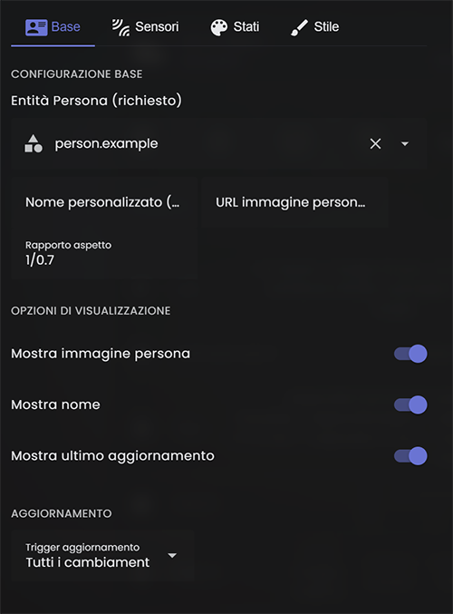
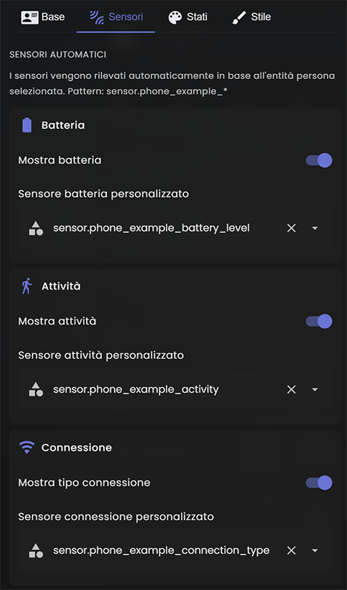
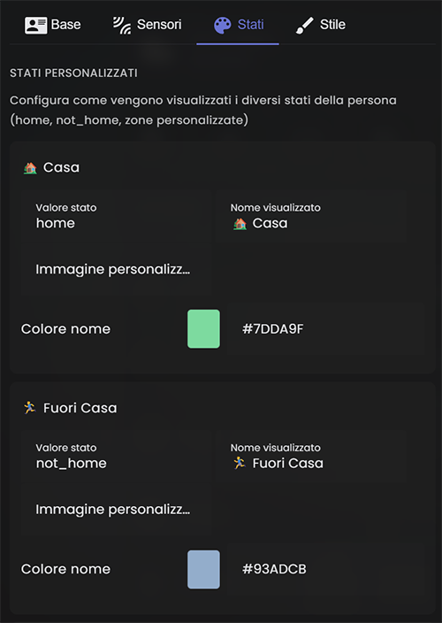

# 👤 Person Tracker Card per Home Assistant

[](https://github.com/custom-components/hacs)


Card avanzata per Home Assistant che mostra informazioni dettagliate sulle persone con editor visuale completo.


## ✨ Caratteristiche Principali

- 📱 **Monitoraggio Batteria** - Visualizza il livello di batteria del dispositivo con icona dinamica
- 🚶 **Tracciamento Attività** - Mostra l'attività corrente (Walking, Running, Automotive, Stationary, Cycling)
- 📍 **Distanza da Casa** - Integrazione con Waze per calcolare la distanza
- ⏱️ **Tempo di Viaggio** - Stima del tempo necessario per raggiungere casa/lavoro
- 📶 **Tipo Connessione** - Mostra se il dispositivo è connesso tramite WiFi o rete mobile
- 🎨 **Stati Personalizzabili** - Colori e immagini differenti per ogni stato (Casa, Ufficio, etc.)
- 🖼️ **Immagini Personalizzate** - Supporto per immagini PNG/GIF trasparenti
- 🎯 **Editor Visuale Completo** - Configurazione facile tramite interfaccia grafica
- 📐 **Layout Flessibile** - Posiziona liberamente ogni elemento sulla card
- 🎨 **Altamente Personalizzabile** - Font, colori, dimensioni, spaziature completamente configurabili

## 📸 Screenshot

### Stati Diversi
| A Casa | In Ufficio | In Viaggio |
|--------|-----------|-----------|
|  |  |  |

### Editor Visuale
| Tab Base | Tab Sensori | Tab Stati |
|----------|------------|----------|
|  |  |  |

## 📦 Installazione

### HACS (Consigliato)

1. Apri HACS nel tuo Home Assistant
2. Vai su "Frontend"
3. Clicca sui tre puntini in alto a destra
4. Seleziona "Repository personalizzati"
5. Aggiungi questo URL: `https://github.com/yourusername/person-tracker-card`
6. Seleziona categoria "Lovelace"
7. Clicca su "Aggiungi"
8. Cerca "Person Tracker Card" e installala
9. Riavvia Home Assistant

### Installazione Manuale

1. Scarica `person-tracker-card.js` e `person-tracker-card-editor.js`
2. Copia i file nella cartella `config/www/person-tracker-card/`
3. Aggiungi la risorsa in Home Assistant:
   - Vai su Impostazioni → Dashboard → Menu (⋮) → Risorse
   - Clicca "+ AGGIUNGI RISORSA"
   - URL: `/local/person-tracker-card/person-tracker-card.js`
   - Tipo: Modulo JavaScript
4. Ricarica la pagina (Ctrl+F5)

## 🔧 Configurazione Base

### Metodo 1: Editor Visuale (Consigliato)

1. Modifica la tua dashboard
2. Aggiungi una nuova card
3. Cerca "Person Tracker Card"
4. Configura tramite l'interfaccia grafica

### Metodo 2: YAML

```yaml
type: custom:person-tracker-card
entity: person.davide
show_entity_picture: true
show_name: true
show_last_changed: true
show_battery: true
show_activity: true
show_distance: true
show_travel_time: true
show_connection: true
```

## ⚙️ Configurazione Avanzata

### Opzioni Complete

```yaml
type: custom:person-tracker-card
entity: person.davide

# Visualizzazione Elementi
show_entity_picture: true
show_name: true
show_last_changed: true
show_battery: true
show_activity: true
show_distance: true
show_travel_time: true
show_connection: true

# Sensori Personalizzati (opzionale)
battery_sensor: sensor.phone_davide_battery_level
activity_sensor: sensor.phone_davide_activity
connection_sensor: sensor.phone_davide_connection_type
distance_sensor: sensor.waze_davide
travel_sensor: sensor.casa_lavoro_davide

# Layout e Dimensioni
aspect_ratio: '1/0.7'
picture_size: 55

# Stili Generali
card_background: 'rgba(255,255,255,0.05)'
card_border_radius: '15px'
name_font_size: '20px'
state_font_size: '14px'

# Posizionamento Elementi
battery_position: top-right
activity_position: bottom-left
distance_position: top-left
travel_position: top-left-2
connection_position: bottom-right

# Dimensioni Font Elementi
battery_font_size: '13px'
activity_font_size: '13px'
distance_font_size: '12px'
travel_font_size: '12px'
connection_font_size: '12px'

# Aggiornamenti
triggers_update: all  # all | entity | custom

# Stati Personalizzati (vedi sotto)
state:
  - value: home
    name: 🏡 Casa
    styles:
      name:
        color: '#7DDA9F'
  - value: not_home
    name: 🏃‍♂️ Fuori Casa
    styles:
      name:
        color: '#93ADCB'
```

### Stati Personalizzati con Immagini

Puoi definire stati personalizzati con colori e immagini diverse:

```yaml
state:
  - value: home
    name: 🏡 Casa
    entity_picture: /local/images/home.png
    styles:
      name:
        color: '#7DDA9F'
  
  - value: Ufficio
    name: 🏢 Ufficio
    entity_picture: /local/images/office.png
    styles:
      name:
        color: '#FFD700'
  
  - value: Palestra
    name: 🏋️ Palestra
    entity_picture: /local/images/gym.gif
    styles:
      name:
        color: '#FF6B6B'
```

### Posizioni Disponibili

Ogni elemento può essere posizionato in una delle seguenti posizioni:

- `top-left` - Alto a sinistra
- `top-right` - Alto a destra
- `bottom-left` - Basso a sinistra
- `bottom-right` - Basso a destra
- `top-left-2` - Alto a sinistra (seconda posizione)
- `top-right-2` - Alto a destra (seconda posizione)
- `bottom-left-2` - Basso a sinistra (seconda posizione)
- `bottom-right-2` - Basso a destra (seconda posizione)

### Modalità di Aggiornamento

L'opzione `triggers_update` controlla quando la card viene aggiornata:

- `all` - Aggiorna quando cambia qualsiasi entità correlata (predefinito)
- `entity` - Aggiorna solo quando cambia l'entità person principale
- `custom` - Aggiorna per entità specifiche definite dall'utente

## 🎨 Creare Immagini Personalizzate

### Con iPhone/iPad

1. **Scarica l'app gratuita "Background Eraser"**
   - Disponibile su App Store
   - Facile da usare per rimuovere sfondi

2. **Crea la tua immagine**:
   - Scatta una foto o usa un'immagine esistente
   - Apri l'app Background Eraser
   - Rimuovi lo sfondo con il dito
   - Esporta come PNG con trasparenza

3. **Per immagini animate (GIF)**:
   - Usa l'app "ImgPlay" (gratuita)
   - Crea una GIF da foto o video
   - Puoi anche rimuovere lo sfondo
   - Esporta come GIF

4. **Carica su Home Assistant**:
   - Copia il file in `config/www/images/`
   - Usa il percorso `/local/images/tuaimmagine.png` nella configurazione

### Dimensioni Consigliate

- **Immagini statiche (PNG)**: 512x512 px
- **GIF animate**: 512x512 px, max 5 MB
- **Formato**: PNG con trasparenza o GIF
- **Sfondo**: Trasparente per migliore integrazione

### Esempi di Immagini

Puoi creare immagini per rappresentare:
- 🏠 Casa - Logo della tua casa
- 🏢 Ufficio - Logo aziendale
- 🏋️ Palestra - Icona fitness
- 🛒 Supermercato - Logo del negozio
- 🚗 In viaggio - Icona auto animata
- ✈️ Aeroporto - Icona aereo

## 📱 Integrazione con Home Assistant Companion App

Per il corretto funzionamento, assicurati che l'app Home Assistant Companion abbia i permessi per:

1. **Posizione**:
   - Vai nelle impostazioni del telefono
   - App → Home Assistant
   - Posizione → Sempre

2. **Batteria**:
   - Automaticamente tracciata dall'app

3. **Attività fisica**:
   - iOS: Impostazioni → Privacy → Movimento e fitness
   - Android: Attiva il sensore di attività nell'app

4. **Connettività**:
   - Automaticamente tracciata dall'app

### Sensori Companion App Utilizzati

La card cerca automaticamente questi sensori:

```
sensor.phone_[nome]_battery_level
sensor.phone_[nome]_activity
sensor.phone_[nome]_connection_type
```

Dove `[nome]` è il nome dell'entità person senza il prefixo `person.`

Esempio per `person.davide`:
```
sensor.phone_davide_battery_level
sensor.phone_davide_activity
sensor.phone_davide_connection_type
```

## 🗺️ Integrazione Waze

Per la distanza da casa, installa l'integrazione Waze Travel Time:

1. Vai su Impostazioni → Dispositivi e servizi
2. Aggiungi integrazione → Cerca "Waze"
3. Configura:
   - Origine: La tua zona home
   - Destinazione: `person.nome`
   - Nome: `waze_nome`

## 🎭 Esempi di Configurazione

### Configurazione Minima

```yaml
type: custom:person-tracker-card
entity: person.davide
```

### Configurazione Completa

```yaml
type: custom:person-tracker-card
entity: person.davide
show_entity_picture: true
show_name: true
show_last_changed: true
show_battery: true
show_activity: true
show_distance: true
show_travel_time: true
show_connection: true
aspect_ratio: '1/0.7'
picture_size: 60
card_background: 'linear-gradient(135deg, rgba(125, 218, 159, 0.1) 0%, rgba(147, 173, 203, 0.1) 100%)'
card_border_radius: '20px'
name_font_size: '22px'
state_font_size: '16px'
battery_position: top-right
activity_position: bottom-left
distance_position: top-left
travel_position: top-left-2
connection_position: bottom-right
state:
  - value: home
    name: 🏡 A Casa
    entity_picture: /local/images/home.gif
    styles:
      name:
        color: '#7DDA9F'
  - value: Ufficio
    name: 🏢 In Ufficio
    entity_picture: /local/images/office.png
    styles:
      name:
        color: '#FFD700'
  - value: not_home
    name: 🌍 In Giro
    entity_picture: /local/images/travel.gif
    styles:
      name:
        color: '#93ADCB'
```

### Solo Informazioni Essenziali

```yaml
type: custom:person-tracker-card
entity: person.davide
show_entity_picture: true
show_name: true
show_last_changed: true
show_battery: true
show_activity: false
show_distance: false
show_travel_time: false
show_connection: true
aspect_ratio: '1/0.5'
```

## 🔍 Risoluzione Problemi

### La card non appare

1. Controlla la console del browser (F12) per errori
2. Verifica che la risorsa sia caricata correttamente
3. Ricarica la pagina con cache vuota (Ctrl+Shift+R)

### I sensori non vengono trovati

1. Controlla che l'app Companion sia installata e configurata
2. Verifica i nomi dei sensori in Strumenti Sviluppatore → Stati
3. Specifica manualmente i sensori nella configurazione

### Le immagini personalizzate non appaiono

1. Controlla che il file sia in `config/www/`
2. Usa il percorso corretto: `/local/cartella/file.png`
3. Verifica i permessi del file
4. Riavvia Home Assistant se necessario

### L'editor non si apre

1. Assicurati di aver caricato entrambi i file JS
2. Ricarica le risorse Lovelace
3. Prova a riavviare Home Assistant

## 📝 Changelog

### v1.0 (2024-11-22)
- 🎉 Prima release pubblica
- ✨ Editor visuale completo
- 📱 Supporto tutti i sensori Companion App
- 🎨 Stati personalizzabili con colori
- 📍 Integrazione Waze per distanze


## 🤝 Contribuire

I contributi sono benvenuti! Per favore:

1. Fai un Fork del progetto
2. Crea un branch per la tua feature (`git checkout -b feature/AmazingFeature`)
3. Committa i cambiamenti (`git commit -m 'Add some AmazingFeature'`)
4. Push al branch (`git push origin feature/AmazingFeature`)
5. Apri una Pull Request

## 📄 Licenza

Questo progetto è rilasciato sotto licenza MIT. Vedi il file [LICENSE](LICENSE) per i dettagli.

## 💝 Supporto

Se questa card ti è utile, considera di:

- ⭐ Mettere una stella al repository
- 🐛 Segnalare bug e problemi
- 💡 Suggerire nuove funzionalità
- 🤝 Contribuire al codice

## 🙏 Ringraziamenti

- Home Assistant Community
- HACS Team
- Tutti i contributori

---

**Creato con ❤️ per la comunità Home Assistant**
